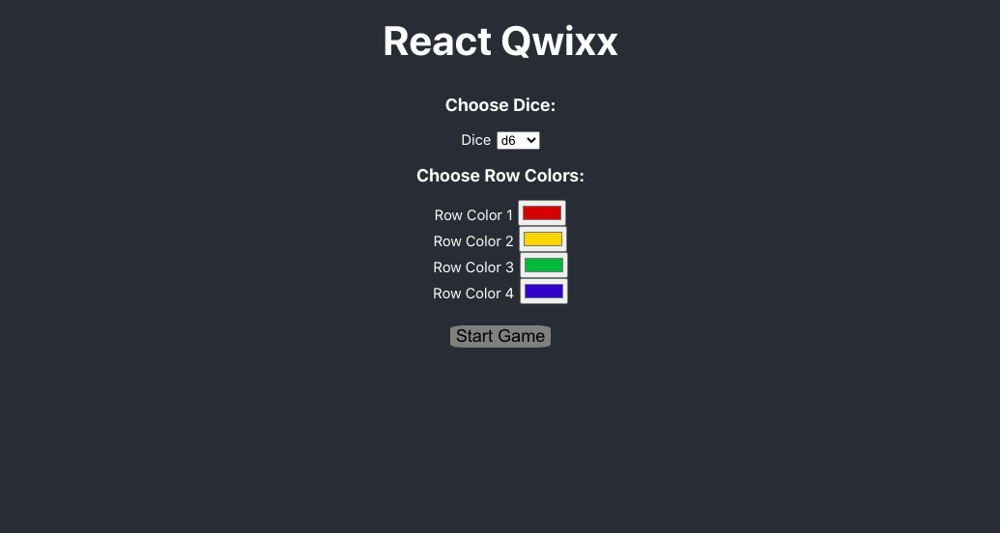
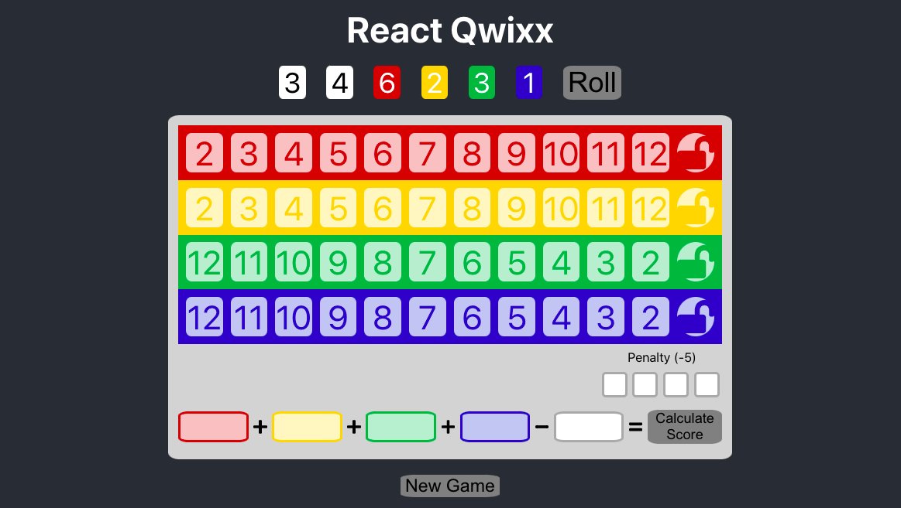
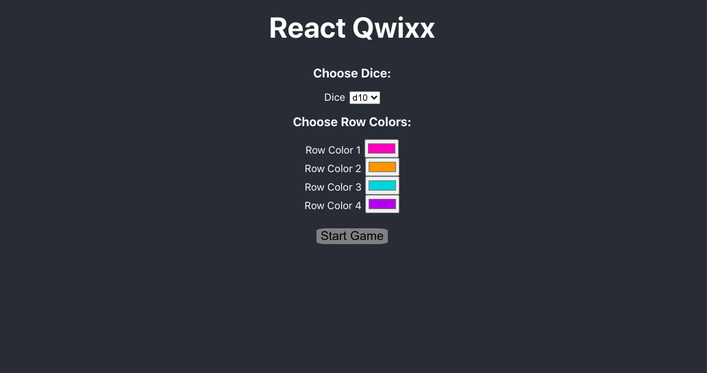
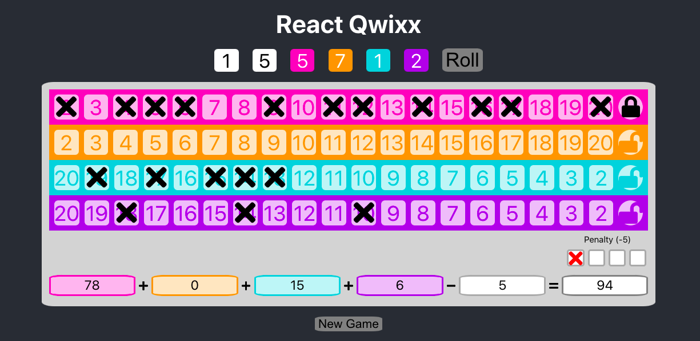

# React Qwixx

Scorecard and dice for the game Qwixx, built with React. Rolls dice randomly, enforces game rules, and automatically calculates score. Allows user to select type of dice used and colors of scorecard rows.

## Setup

To install needed dependencies, run `npm install`.

## Usage

To start the app in development mode, run `npm start`. Open [http://localhost:3000](http://localhost:3000) to view it in the browser.

To run tests in watch mode, use `npm test`.

To build the app for production (in the `build` folder), use `npm run build`.

## Gameplay

Use the select menu and color pickers to choose dice type and row colors. (Keep in mind that especially light colors may be difficult to read, and colors that are too similar to each other may be confusing.) To begin the game, press the "Start Game" button.

Click "Roll" button to roll dice. Click to mark spaces, locks, and penalty boxes. Click "Calculate Score" button to show row scores and total.

Once the game has started, press the "New Game" button at any time to return to the customization form and start over.

## Images

## Acknowledgements

This project was bootstrapped with [Create React App](https://github.com/facebook/create-react-app).

Qwixx belongs to [Gamewright](https://gamewright.com/product/Qwixx). No copyright infringement is intended by this project.
